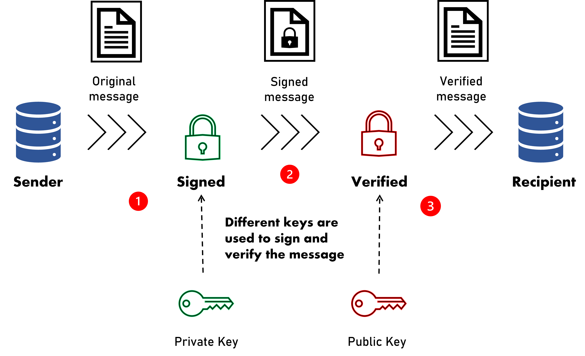

import Breadcrumbs from '@site/src/components/Breadcrumbs'; 
import Tabs from '@theme/Tabs';
import TabItem from '@theme/TabItem';

<Breadcrumbs/>

# Message Signature

## What is Public Key Infrastructure (PKI)

:::info

Participants are allowed to have more than one certificate/key tied to each profile and can choose which one to use for signing and verification.
:::

The DuitNow API uses Public Key Infrastructure (PKI), which is a technology for authenticating users and devices in the digital world. The basic idea is to have one or more trusted parties digitally sign documents certifying that a particular cryptographic key belongs to a particular user or device.

The main feature of PKI is that it uses a pair of different but related keys. The key pair consists of the public key and the private key. The public key can be shared whereas the private key must be kept secret. The key pair guarantees that information encrypted with the public key can only be decrypted by the intended recipient, the holder of the private key. Conversely, when the information is encrypted with the private key and decrypted with the public key, the key pair guarantees that the information originated from a trusted source.

Refer to the PKI flow:





**1.** The sender signs the original message with the sender's private key.

**2.** The signed message is sent securely over to the recipient.

**3.** The signed message can only be verified by the corresponding public key before the recipient can consume the message.


The certificate is the mechanism by which the public key is shared. A certificate is authorised by a trusted source, known as the certificate authority (CA). Participants are required to generate their own private key in RSA-SHA256 format. Once this key is generated, they will need to create a certificate to be uploaded to RPP before the API can be consumed.


## How to Generate Key Pair

### Using OpenSSL

**Step 1**: Generate private key and CSR (Certificate Signing Request)

```
openssl req \
       -newkey rsa:2048 -nodes -keyout example.key \
       -out example.csr
```

**Step 2**: Generate self-signed certificate from generated CSR

:::info

For production usage, this certificate must be created by valid Certificate Authority (CA). Self-signed certificate only valid for sandbox usage.
:::
```
openssl x509 \
       -signkey example.key \
       -in example.csr \
       -req -days 365 -out example.cer
```


## Sample codes

### Message Signing
<Tabs
  defaultValue="java"
  values={[
    {label: 'Java', value: 'java'},
    {label: 'Phython', value: 'phyton'},
    {label: 'PHP', value: 'php'},
    {label: 'C#', value: 'c#'},
  ]}>
  <TabItem value="java">

```js
import java.io.BufferedReader;
import java.io.FileInputStream;
import java.io.IOException;
import java.io.InputStreamReader;
import java.nio.charset.StandardCharsets;
import java.security.KeyFactory;
import java.security.NoSuchAlgorithmException;
import java.security.PrivateKey;
import java.security.PublicKey;
import java.security.Signature;
import java.security.cert.CertificateException;
import java.security.cert.CertificateFactory;
import java.security.cert.X509Certificate;
import java.security.spec.InvalidKeySpecException;
import java.security.spec.PKCS8EncodedKeySpec;
import java.util.Base64;
import java.util.stream.Collectors;

public class SampleCode {

  private static final String KEY_ALGORITHM = "RSA";
  private static final String SIGNATURE_ALGORITHM = "SHA256withRSA";

  public static void main(String[] args) throws Exception {
    // path to private key and public certificate
    String privateKeyPath = "path_to_private_key";
    String publicKeyPath = "path_to_rpp_public_certificate";

    // message to sign
    String message = "message_to_sign";

    // signature to verify
    String responseSignature = "signature_to_verify";

    // Request Signing (Use to construct Request Message X-Signature)
    Signature signature = Signature.getInstance(SIGNATURE_ALGORITHM);
    signature.initSign(createPrivateKeyInstance(privateKeyPath));
    signature.update(message.getBytes(StandardCharsets.UTF_8));
    System.out.println(Base64.getEncoder().encodeToString(signature.sign()));


  public static PrivateKey createPrivateKeyInstance(String pathToKey)
    throws IOException, NoSuchAlgorithmException, InvalidKeySpecException {
    try (
      BufferedReader reader = new BufferedReader(
        new InputStreamReader(new FileInputStream(pathToKey))
      )
    ) {
      String content = reader
        .lines()
        .filter(line -> !line.startsWith("-----"))
        .collect(Collectors.joining());
      KeyFactory factory = KeyFactory.getInstance(KEY_ALGORITHM);
      PKCS8EncodedKeySpec keySpec = new PKCS8EncodedKeySpec(
        Base64.getDecoder().decode(content)
      );
      return factory.generatePrivate(keySpec);
    }
  }

  public static PublicKey createPublicKeyInstance(String pathToKey)
    throws IOException, NoSuchAlgorithmException, CertificateException {
    try (FileInputStream reader = new FileInputStream(pathToKey)) {
      CertificateFactory f = CertificateFactory.getInstance("X.509");
      X509Certificate certificate = (X509Certificate) f.generateCertificate(
        reader
      );
      return certificate.getPublicKey();
    }
  }
}
```
  </TabItem>
  <TabItem value="phyton">

```python
from Crypto.PublicKey import RSA
from Crypto.Hash import SHA256
from Crypto.Signature import PKCS1_v1_5
from base64 import b64decode, b64encode

private_key = 'privateKey'
rpp_request_data = "requestData"

def sign():
    key_bytes = bytes(private_key)
    key_bytes = b64decode(key_bytes)
    key = RSA.importKey(key_bytes)
    hash_value = SHA256.new(bytes(rpp_request_data))
    signer = PKCS1_v1_5.new(key)
    signature = signer.sign(hash_value)
    return b64encode(signature)

res = sign()
print(res)
```

  
  </TabItem>
  <TabItem value="php">


```
//read/parse private key
$pvtKeyRes = openssl_pkey_get_private(file_get_contents('apigate.key'));
openssl_pkey_export($pvtKeyRes, $pvtKey);
echo $pvtKey . PHP_EOL;

//read/parse public key
$pubKeyRes = openssl_pkey_get_public(file_get_contents('apigate.pub'));
$dtlKey = openssl_pkey_get_details($pubKeyRes);
echo 'bits=[' . $dtlKey['bits'] . ']' . PHP_EOL;
$pubKey = $dtlKey['key'];
echo $pubKey . PHP_EOL;

$message = 'ABCDEFGHIJKLMNOPQRSTUVWXYZ';
echo 'message   := ' . $message . PHP_EOL;

//sign
$sigAlgo = 'sha256WithRSAEncryption';
$mdMethods = openssl_get_md_methods(true);
$found = false;

foreach ($mdMethods as $mdMethod) {
    if ($sigAlgo === $mdMethod) {
        $found = true;
        break;
    }
}

if ($found === false) {
    throw new Exception("method=[$sigAlgo] not found");
}


// verify
$signatureBytes = base64_decode($signature);
$verify = openssl_verify($message, $signatureBytes, $pubKeyRes, $sigAlgo);
openssl_pkey_free($pubKeyRes);

if ($verify === -1) {
    echo 'error while verifying' . PHP_EOL;
} elseif ($verify === 0) {
    echo 'Wrong signature' . PHP_EOL;
} elseif ($verify === 1) {
    echo 'Correct signature' . PHP_EOL;
} else {
    throw new Exception('fail to verify message');
}

```


  
  </TabItem>
  <TabItem value="c#">

```C#
using System;
using System.Security.Cryptography.X509Certificates;
using System.Security.Cryptography;

// namespace declaration
namespace SignApp{

    // Class declaration
    class Sign {

        public static string SignData(byte[] data, string pkcs12File, string pkcs12Password)
        {
            X509Certificate2 signerCert = new X509Certificate2(pkcs12File, pkcs12Password, X509KeyStorageFlags.Exportable);
            RSACryptoServiceProvider rsaCSP = new RSACryptoServiceProvider();
            rsaCSP.FromXmlString(signerCert.PrivateKey.ToXmlString(true));
            var SignedData = rsaCSP.SignData(data, CryptoConfig.MapNameToOID("SHA256"));
            return Convert.ToBase64String(SignedData);
        }

    }
}

```
  
   </TabItem>

</Tabs>


### Message Verification

<Tabs
  defaultValue="java"
  values={[
    {label: 'Java', value: 'java'},
    {label: 'PHP', value: 'php'},
    {label: 'C#', value: 'c#'},
  ]}>
  <TabItem value="java">  

```java
import java.io.BufferedReader;
import java.io.FileInputStream;
import java.io.IOException;
import java.io.InputStreamReader;
import java.nio.charset.StandardCharsets;
import java.security.KeyFactory;
import java.security.NoSuchAlgorithmException;
import java.security.PrivateKey;
import java.security.PublicKey;
import java.security.Signature;
import java.security.cert.CertificateException;
import java.security.cert.CertificateFactory;
import java.security.cert.X509Certificate;
import java.security.spec.InvalidKeySpecException;
import java.security.spec.PKCS8EncodedKeySpec;
import java.util.Base64;
import java.util.stream.Collectors;

public class SampleCode {

  private static final String KEY_ALGORITHM = "RSA";
  private static final String SIGNATURE_ALGORITHM = "SHA256withRSA";

  public static void main(String[] args) throws Exception {
    // path to private key and public certificate
    String privateKeyPath = "path_to_private_key";
    String publicKeyPath = "path_to_rpp_public_certificate";

    // message to sign
    String message = "message_to_sign";

    // signature to verify
    String responseSignature = "signature_to_verify";

    // Response Verification (Use to verify Response Message X-Signature)
    PublicKey publicKey = createPublicKeyInstance(publicKeyPath);
    Signature signatureResponse = Signature.getInstance(SIGNATURE_ALGORITHM);
    signatureResponse.initVerify(publicKey);
    signatureResponse.update(message.getBytes(StandardCharsets.UTF_8));
    boolean flag = signatureResponse.verify(
      Base64.getDecoder().decode(responseSignature)
    );
    if (flag) {
      System.out.println("verified successfully");
    }
  }

  public static PrivateKey createPrivateKeyInstance(String pathToKey)
    throws IOException, NoSuchAlgorithmException, InvalidKeySpecException {
    try (
      BufferedReader reader = new BufferedReader(
        new InputStreamReader(new FileInputStream(pathToKey))
      )
    ) {
      String content = reader
        .lines()
        .filter(line -> !line.startsWith("-----"))
        .collect(Collectors.joining());
      KeyFactory factory = KeyFactory.getInstance(KEY_ALGORITHM);
      PKCS8EncodedKeySpec keySpec = new PKCS8EncodedKeySpec(
        Base64.getDecoder().decode(content)
      );
      return factory.generatePrivate(keySpec);
    }
  }

  public static PublicKey createPublicKeyInstance(String pathToKey)
    throws IOException, NoSuchAlgorithmException, CertificateException {
    try (FileInputStream reader = new FileInputStream(pathToKey)) {
      CertificateFactory f = CertificateFactory.getInstance("X.509");
      X509Certificate certificate = (X509Certificate) f.generateCertificate(
        reader
      );
      return certificate.getPublicKey();
    }
  }
}

```


  </TabItem>
  <TabItem value="php">  

```php
//read/parse private key
$pvtKeyRes = openssl_pkey_get_private(file_get_contents('apigate.key'));
openssl_pkey_export($pvtKeyRes, $pvtKey);
echo $pvtKey . PHP_EOL;

//read/parse public key
$pubKeyRes = openssl_pkey_get_public(file_get_contents('apigate.pub'));
$dtlKey = openssl_pkey_get_details($pubKeyRes);
echo 'bits=[' . $dtlKey['bits'] . ']' . PHP_EOL;
$pubKey = $dtlKey['key'];
echo $pubKey . PHP_EOL;

$message = 'ABCDEFGHIJKLMNOPQRSTUVWXYZ';
echo 'message   := ' . $message . PHP_EOL;

//sign
$sigAlgo = 'sha256WithRSAEncryption';
$mdMethods = openssl_get_md_methods(true);
$found = false;

foreach ($mdMethods as $mdMethod) {
    if ($sigAlgo === $mdMethod) {
        $found = true;
        break;
    }
}

if ($found === false) {
    throw new Exception("method=[$sigAlgo] not found");
}


// verify
$signatureBytes = base64_decode($signature);
$verify = openssl_verify($message, $signatureBytes, $pubKeyRes, $sigAlgo);
openssl_pkey_free($pubKeyRes);

if ($verify === -1) {
    echo 'error while verifying' . PHP_EOL;
} elseif ($verify === 0) {
    echo 'Wrong signature' . PHP_EOL;
} elseif ($verify === 1) {
    echo 'Correct signature' . PHP_EOL;
} else {
    throw new Exception('fail to verify message');
}

```


  </TabItem>
  <TabItem value="c#">

```java
using System;
using System.Security.Cryptography.X509Certificates;
using System.Security.Cryptography;

// namespace declaration
namespace SignApp{

    // Class declaration
    class Sign {


        public static bool VerifySignature(byte[] data, string signature, string publicCert)
        {
            X509Certificate2 partnerCert = new X509Certificate2(publicCert);
            RSACryptoServiceProvider rsaCSP = (RSACryptoServiceProvider)partnerCert.PublicKey.Key;
            return rsaCSP.VerifyData(data, CryptoConfig.MapNameToOID("SHA256"), Convert.FromBase64String(signature));
        }
    }
}

```  
  </TabItem>
  

</Tabs>