import Breadcrumbs from '@site/src/components/Breadcrumbs'; 

<Breadcrumbs/>

# FI Server

The report server enables participants to access reports available for download. The server is exposed through FTP and can only be connected through a Direct Connect connection. These servers are generic and applicable to all products. Participants may download required reports as and when required.

| Environment  | IP Address(es)  |
| ------------ | --------------- |
| SIT          | 103.145.216.162 |
| UAT          | 103.145.216.162 |
| Production   | 103.145.216.86  |
| DR           | 103.145.217.86  |

## SSH Key Generation and Sharing Instructions (with PuTTY Key Generator)

This section outlines how to generate SSH keys and transfer a public key to PayNet. SSH key authentication will be the only method available for FI-Report connection.

### Pre-Requisite

- Download and install PuTTYgen from <a href="/documentation" className="blue-link bold">https://www.puttygen.com/</a>  
- PuTTYgen installed successfully.

### Instructions (Windows 10)

- Start PuTTYgen which can be found in Windows Start menu.
  

  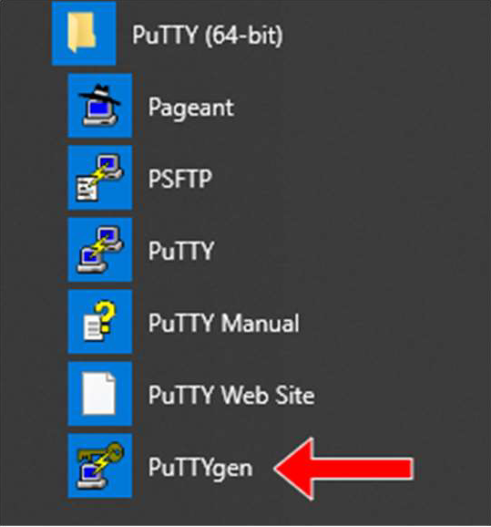

  

- Ensure Key Type is set to **ECDSA** and click **Generate.** Please see **Step 3i** If your infrastructure does not support ECDSA.
  

  

  

- Move your mouse cursor until green progress bar is full.
  

  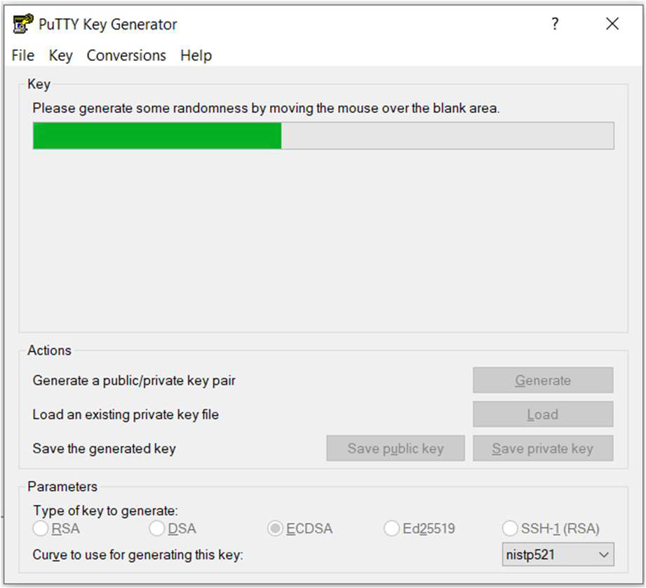

  

  - Use **RSA** with **4096** bit in case your infrastructure does not support ECDSA 521
    

    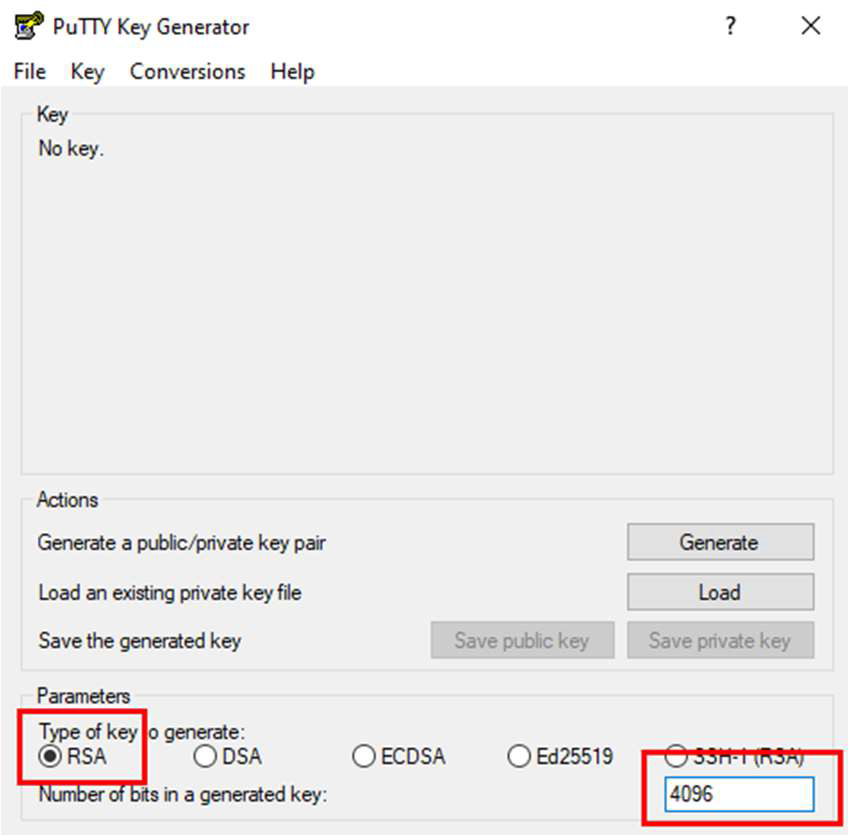

    

- Save the public key as **authorized_keys** and private key (passphrase is optional) in a secured location and copy all the contents of public key in PuTTYGen.
  

    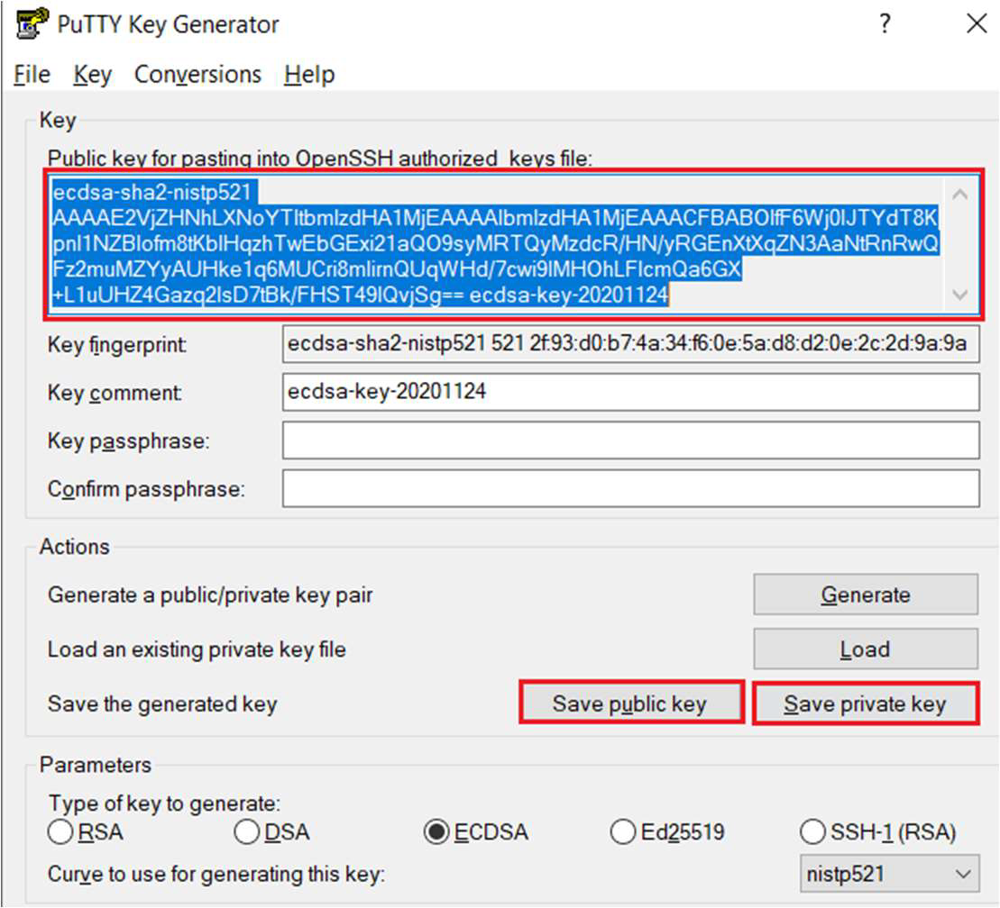

  

- Navigate to where authorized_keys is saved and open with Notepad. Replace the public key string in authorized_keys file and save the file.
  

    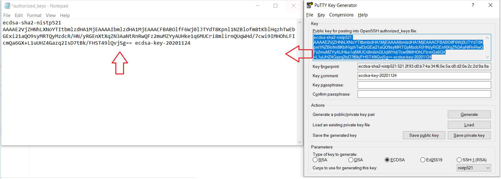

  

- Use PuTTY to initiate first SSH connectivity to Reports server infrastructure with new user account and OTP issued by PayNet SAC. For internet connectivity, please ensure PayNet IP is whitelisted in your company firewall.
- Open a Command Prompt in your Windows machine and navigate to the location where the public key is saved.
- The commands for connecting to different infrastructures are listed below. Run the command for the infrastructure you wish to connect to:
  

    - UAT internet: `scp authorized_keys <username>@reports.uat.inet.paynet.my:.ssh/`
    - PRD internet: `scp authorized_keys <username>@reports.prod.inet.paynet.my:.ssh/`
    - UAT MPLS: `scp authorized_keys <username>@reports.uat.mpls.paynet.my:.ssh/`
    - PRD  MPLS: `scp authorized_keys <username>@reports.prod.mpls.paynet.my:.ssh/`

  

- You will be prompted to enter a password. Enter the password provided by PayNet SAC in email and upload of public key will start.
  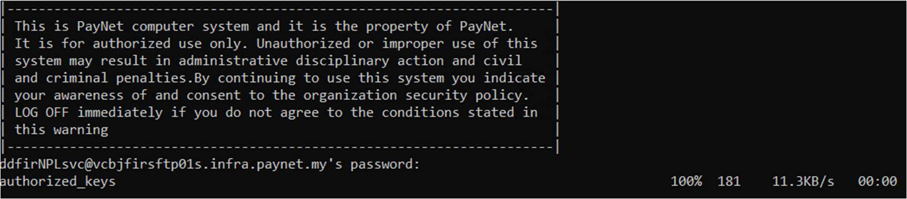

- Once done, you will be able to login to PayNet Reports server. You will need to ensure PayNet internet IP is whitelisted in your company firewall. Please see <a href="#" className="blue-link bold">Connecting to SFTP with PuTTY and SSH key.</a>

### Instructions (Linux)

- Run command `ssh-keygen -t ecdsa -b 521` and press enter until public and private keys are generated.
  

  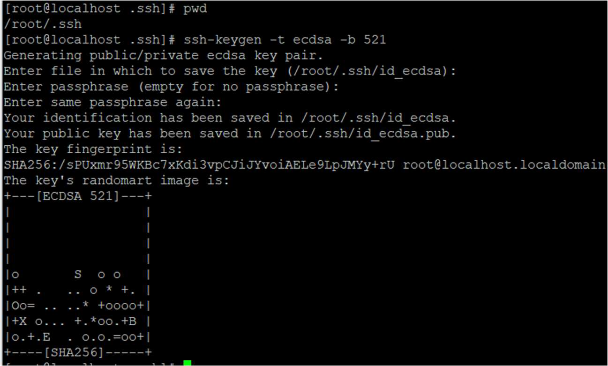

  

  - Use **RSA** with **4096** bit in case your infrastructure does not support ECDSA 521
    

      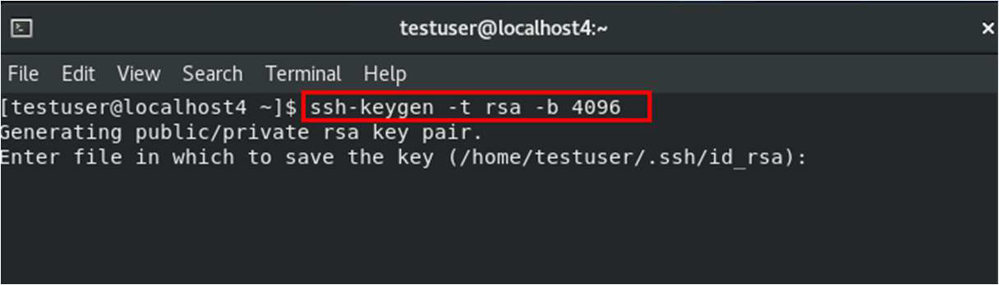

    

- The commands for different infrastructures are listed below. Paynet SAC will provide username and password in email for this step.
  

  - UAT internet: `ssh-copy-id -i ~/.ssh/id_ecdsa.pub username@reports.uat.inet.paynet.my`
  - PRD internet: `ssh-copy-id -i ~/.ssh/id_ecdsa.pub username@reports.prod.inet.paynet.my`
  - UAT MPLS: `ssh-copy-id -i ~/.ssh/id_ecdsa.pub username@reports.uat.mpls.paynet.my`
  - PRD  MPLS: `ssh-copy-id -i ~/.ssh/id_ecdsa.pub username@reports.prod.mpls.paynet.my`

  

- Public key copied to SFTP server successfully.

  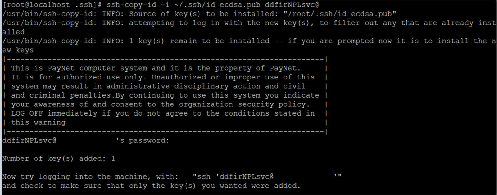

## Connecting to SFTP with PuTTY and SSH Key

Introduction for variant content of table with the link

- Start PuTTY and insert your username in **Auto-login username.**
  

    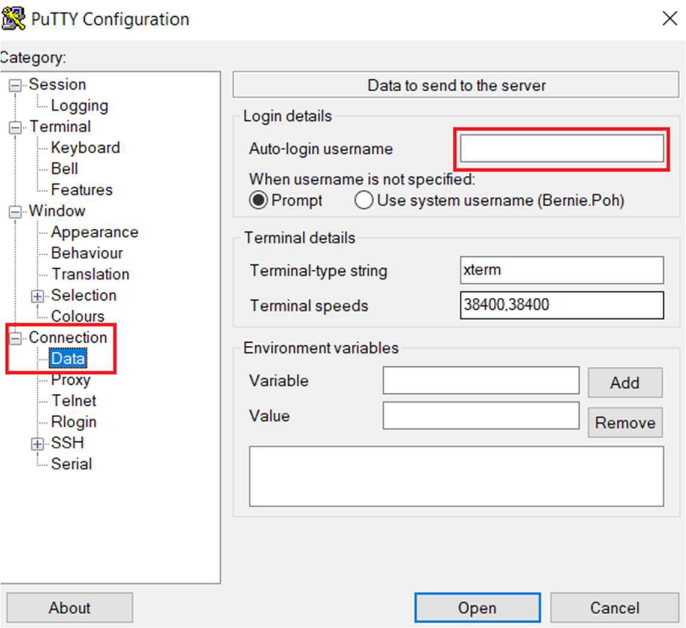

  

- Locate SSH > Auth and click **Browse** to locate your private key and click **Open.** You are now connected to SFTP server.
  

    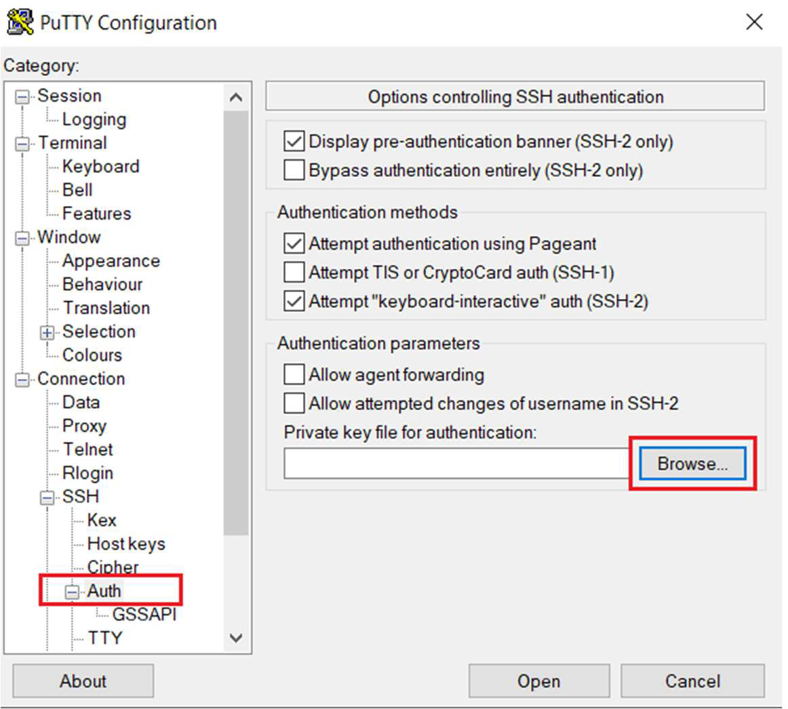

  

- Run command `ssh-i <private key> <username>@<sftp>` to connect from terminal.

## Connecting to SFTP with WinSCP and SSH Key

- Start up WinSCP and enter **Host name** and **User name** and click **Advance.**
  

    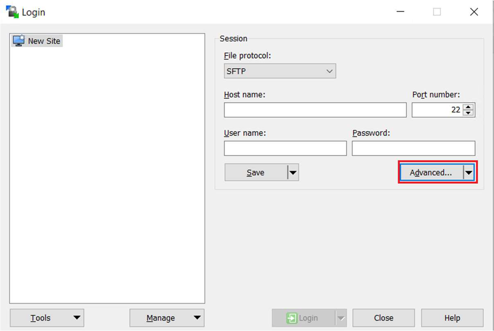

  

  
- Locate SSH > Authentication and click on … to location where private key is saved and click **OK.**
  

    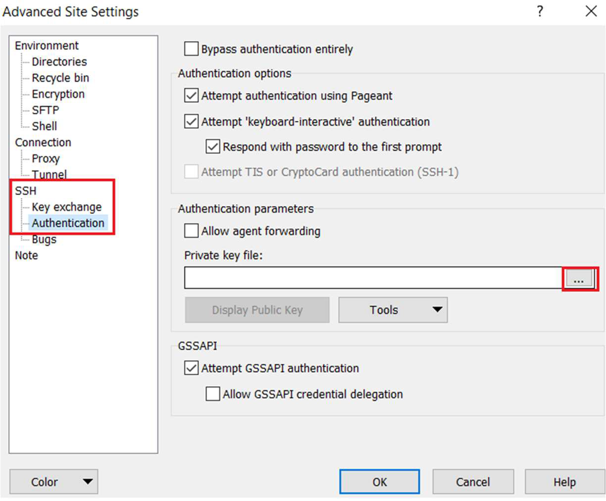

  

 **2.** Locate SSH > Authentication and click on … to location where private key is saved and click **OK.**